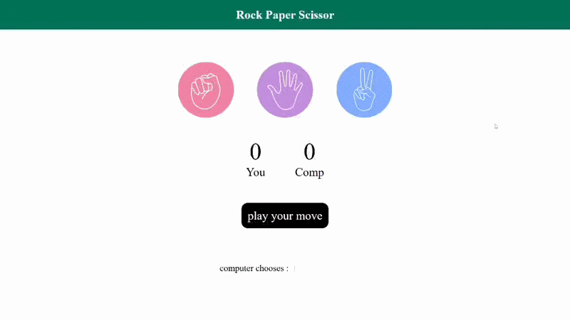

# 🎮 Rock Paper Scissor Game

<p align="center">
  
  
  
</p>

<p align="center">
  <b>A fun and interactive Rock Paper Scissor Game built using HTML, CSS & JavaScript.</b>
</p>

<p align="center">
  <a href="https://dhanainaitik.github.io/Stone-Paper-Scissors-game/">
    
  </a>
</p>

---

# 🎥 Demo

<p align="center">
  
</p>

---

# 🚀 Live Demo

### 🔗 https://dhanainaitik.github.io/Stone-Paper-Scissors-game/

---

# ✨ Features

- 🎮 Interactive Rock Paper Scissor gameplay
- 🤖 Random Computer Choice Generator
- 📈 Real-time Score Tracking
- 🏆 Win / Lose / Draw Detection
- 💬 Dynamic Result Messages
- 🖼️ Computer Choice Display
- 📱 Fully Responsive UI
- ⚡ Fast & Lightweight
- 🎯 Beginner-Friendly JavaScript Project

---

# 🛠️ Tech Stack

| Technology | Usage |
|------------|-------|
| HTML5 | Structure |
| CSS3 | Styling & Responsive Design |
| JavaScript (ES6) | Game Logic |

---

# 📂 Project Structure

```text
📦 Stone-Paper-Scissors-game
│
├── index.html
├── style.css
├── script.js
├── demo.gif
├── rock hai.png
├── paper hai.png
├── scissor hai.png
└── README.md
```

---

# 🎮 Game Rules

| Player | Computer | Result |
|--------|----------|--------|
| 🪨 Rock | ✂️ Scissor | ✅ Win |
| 🪨 Rock | 📄 Paper | ❌ Lose |
| 📄 Paper | 🪨 Rock | ✅ Win |
| 📄 Paper | ✂️ Scissor | ❌ Lose |
| ✂️ Scissor | 📄 Paper | ✅ Win |
| ✂️ Scissor | 🪨 Rock | ❌ Lose |

---

# 🚀 Getting Started

Clone the repository

```bash
git clone https://github.com/dhanainaitik/Stone-Paper-Scissors-game.git
```

Move into the project

```bash
cd Stone-Paper-Scissors-game
```

Open

```text
index.html
```

in your browser.

---

# 📈 Future Improvements

- 🔊 Sound Effects
- 🌙 Dark Mode
- 🎨 Better Animations
- 🧠 Difficulty Levels
- 💾 Local Storage High Score
- 👥 Multiplayer Mode
- ⏱️ Countdown Timer

---

# 🤝 Contributing

Contributions are welcome!

1. Fork the repository
2. Create a feature branch
3. Commit your changes
4. Push your branch
5. Open a Pull Request

---

# 👨‍💻 Author

## Naitik Dhanai

<p align="left">
<a href="https://github.com/dhanainaitik">

</a>

<a href="https://www.linkedin.com/in/naitik-dhanai-a424a6381/">

</a>

<a href="https://www.youtube.com/@dhanainaitik">

</a>
</p>

---

<p align="center">

### ⭐ If you found this project useful, don't forget to Star this repository!

Made with ❤️ by **Naitik Dhanai**

</p>
